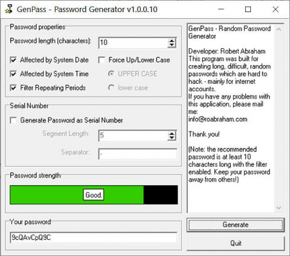

# GenPass - Password Generator

*This free application lets you generate hard-to-hack passwords. The generated passwords can easily be customized to fit your needs, you can even generate serial numbers for your own applications with it. I developed this application when I was a student at university as a little additional project to learn how to code but I don't really use it nowadays as I have built its functionality into larger applications. You can download and use it, basically for any purpose, but it comes without warranty and **you may use it only at your own risk**!*

## Features

- Set password length;
- Make system clock take effect in generated passwords (so the probability of the same password's occurence will be minimal);
- Filter repeating periods to make the generated password harder to crack;
- Force uppercase/lowercase (easier to memorize but easier to crack);
- Make the generated password look like a serial number so you can use it to protect your own applications;
- Check how secure your new password is.

## System requirements

The program does not have any special requirements. It was built as a standard Windows application, so all you need to have is **Microsoft Windows XP SP3** or later. It may work on other Windows-like systems (such as [**Wine**](https://www.winehq.org/) for *Linux*) as well but there is no guarantee for that.

## Compiling

To compile this application, you need [**Lazarus IDE**](https://www.lazarus-ide.org/) with FreePascal compiler. You may need to adjust the project settings to fit your needs.
